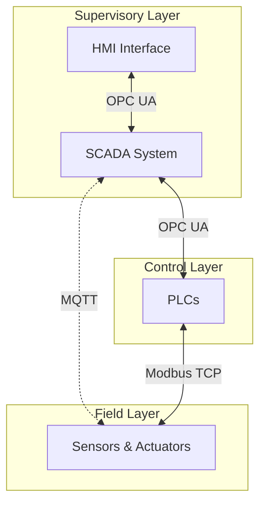
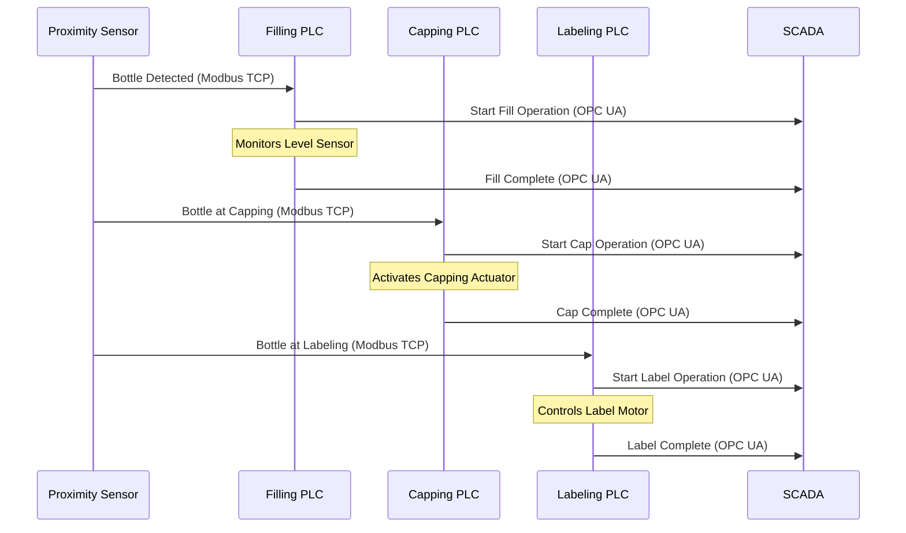

# bottling-factory-simulation

# Industrial Bottling Factory Simulation

A sophisticated simulation of an industrial bottling factory that demonstrates industrial automation protocols (Modbus TCP, MQTT, OPC UA) and PLC-based control systems.

## Overview

This project simulates a complete bottling production line with the following stations:

- Filling Station
- Capping Station
- Labeling Station

The system implements a full industrial automation stack:



## Architecture

### Supervisory Layer

- SCADA System for process monitoring and control
- HMI Interface for operator interaction
- OPC UA communication with PLCs
- MQTT telemetry for sensor data

### Control Layer

- Dedicated PLCs for each station:
  - Filling PLC
  - Capping PLC
  - Labeling PLC
  - Conveyor PLC
- Modbus TCP communication with field devices

### Field Layer

- Sensors:
  - Proximity sensors for bottle detection
  - Level sensors for fill monitoring
  - Temperature sensors for process monitoring
- Actuators:
  - Control valves
  - Conveyor motors
  - Capping actuators
  - Labeling motors

## Network Architecture

The system implements three industrial protocols:

1. **Modbus TCP**

   - Field device communication
   - Sensor readings and actuator control
   - Register-based data exchange

2. **MQTT**

   - Telemetry data collection
   - Asynchronous sensor updates
   - Real-time monitoring

3. **OPC UA**
   - PLC to SCADA communication
   - Structured data model
   - Secure, reliable data exchange

## Process Flow

The bottling process follows this sequence:



## Features

- Real-time simulation of industrial processes
- Multi-protocol network communication
- Packet capture and analysis
- SCADA system with HMI interface
- Comprehensive logging system
- Error handling and fault detection
- Production metrics and analytics

## Getting Started

1. Install dependencies:

```bash
pip install -r requirements.txt
```

2. Configure settings in `config/settings.py`

3. Run the simulation:

```bash
python main.py
```

4. Access the HMI interface at `http://localhost:8001`

## Network Monitoring

The system captures network traffic for analysis:

- Modbus packets: `captures/modbus_traffic.pcap`
- MQTT packets: `captures/mqtt_traffic.pcap`
- OPC UA packets: `captures/opcua_traffic.pcap`

## Logging

Comprehensive logging is available in the `logs` directory:

- Network communication
- Process events
- System status
- Error conditions

## Configuration

Key parameters can be adjusted in `config/settings.py`:

- Timing settings
- Network ports
- Station positions
- Simulation speed

## Development

The project is structured into several key components:

- `devices/`: PLC and field device implementations
- `network/`: Protocol managers and packet capture
- `scada/`: SCADA system and HMI interface
- `simulation/`: Core process simulation
- `utils/`: Logging and helper functions
